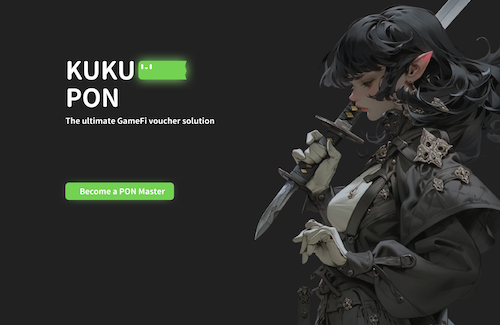

# Kukupon

> Where Gift Cards Meet Blockchain Gaming




## Introduction

Kukupon is a revolutionary platform that combines the best of gift cards and blockchain technology to provide a seamless and secure way for users to enter the world of GameFi.

It is a more efficient and flexible solution that can reduce operational costs while providing better user experiences and more effective promotion tracking.

For more information about our design philosophy, please refer to our [white paper](whitepaper.md).

## Features

- Supports a guest mode for new players
- Provides entry NFTs
- Combines the advantages of Faucet and POAP with GameFi onboarding
- Wallet-less solution ensures the highest security without any burden
- Allows seamless gameplay across multiple devices
- Utilizes various key technologies to provide a secure and flexible gaming experience

## How to Use

1. Obtain a voucher code from a participating game developer
2. Input the voucher code in the designated field to access the account and start playing
3. Use different devices with the same voucher code for seamless gameplay across multiple devices

## Use Cases

- Social media promotion
- Influencer marketing
- Community building
- Rewarding loyal players
- Providing in-game items, currency, or other rewards with gift cards
- Providing discounts for purchases in the game
- Redeeming rewards or participating in special item or event giveaways
- Attracting new players

## Prerequisites

Before using this repo, please make sure you have the following installed:

### Frontend Prerequisites

Before running the frontend, make sure you have the following installed:

- [Node.js](https://nodejs.org/) v14 or higher

#### Installing Frontend

To install the frontend, follow these steps:

1. Clone this repository
2. `cd` into the `frontend` directory
3. Run `pnpm install` to install the necessary dependencies
4. Run `pnpm run dev` to start the development server
5. Open your browser and navigate to `http://localhost:3000`

### Contract Prerequisites

Before deploying the smart contract, make sure you have the following installed:

- [Hardhat](https://hardhat.org/) v2.0 or higher
- [Solidity](https://soliditylang.org/) v0.8.0 or higher

#### Installing Contract

To install the contract, follow these steps:

1. Clone this repository
2. `cd` into the `contract` directory
3. Run `pnpm install` to install the necessary dependencies
4. Run `npx hardhat compile` to compile the contract code
5. Run `npx hardhat test` to run the contract tests
6. Run `npx hardhat run scripts/deploy-paymaster.ts --network <network>` to deploy the paymaster contract to the specified network

### Backend Prerequisites

Before running the backend, make sure you have the following installed:

- [Go](https://golang.org/) v1.17 or higher

## Third-Party Packages

1. [ERC-4337 Account Abstract](https://eips.ethereum.org/EIPS/eip-4337)
2. [Worldcoin](https://worldcoin.org/)
3. [airstack](https://www.airstack.xyz/)

## Getting Started

1. Clone the repository to your local machine:

   ```bash
   git clone https://github.com/yourusername/kukupon.git
   ```

2. Change to the project's directory:

   ```bash
   cd kukupon
   ```

3. Install dependencies:

   ```bash
   go mod download
   ```

4. Copy the example configuration file `config/env.sh.example` to `config/env.sh`:

   ```bash
   cp config/env.sh.example config/env.sh
   ```

5. Modify the configuration file `config/env.sh` with the appropriate parameters. Refer to the comments in the file for more information about the parameters.

6. Run the project:

   ```bash
   make run
   ```

## Configuration Parameters

Please refer to `config/env.sh.example` for a list of configuration parameters.

## Contributors (sorted in alphabetical order)

- [Alan](https://github.com/Yu-Qi): Backend Engineer
- [Dorara](https://github.com/t42ji2ji): Full-Stack Engineer
- [Harry](https://github.com/a00012025): Architect
- [Kordan](https://github.com/hitripod): Product Manager
- [Kuan](https://github.com/kuan0808): Frontend Engineer

### How to Contribute

Please refer to [Contributor docs](./CONTRIBUTE.md).

## Demo

<https://eth-tokyo-2023-kukupon.vercel.app>
